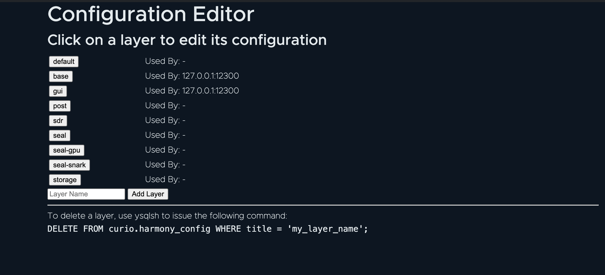
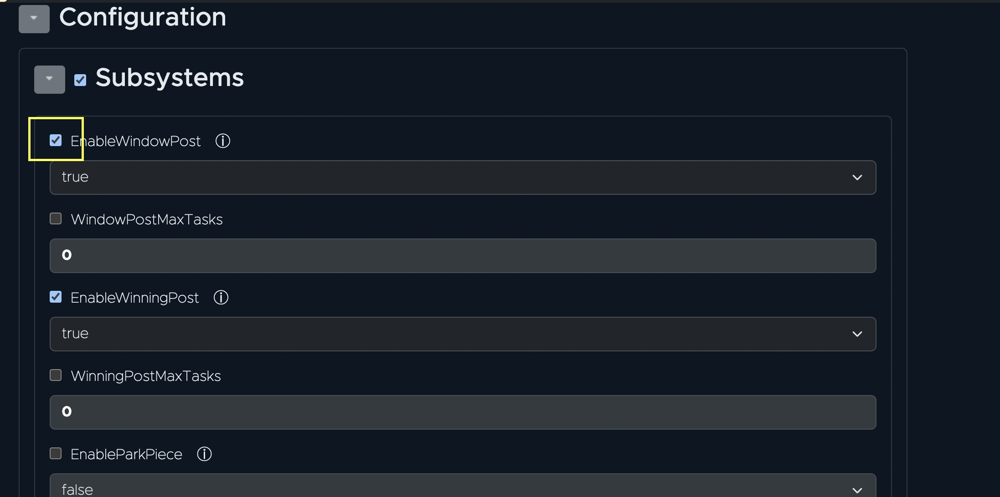

# Configuration

The configuration for Curio is stored in the HarmonyDB in a table called `harmony_config`. When a Curio node is started, one or more layer names are supplied to get the desired configuration for the node.

## Configuration Layers&#x20;

Configuration layers provide a set of configuration parameters that determine how a system will operate. These layers can be defined at different levels, meaning that higher layer can override the lower layer, and the system will behave based on the final stacked output.

Configuration layers can be arranged in a hierarchy, often from `base`(most general) to most specific. The `base` layer defines default configuration values. More specific layers override these defaults with more targeted configurations.

For example, in a simple two-layer configuration system, layers could be organized in the following order: Base Layer - This is the most general layer. It is always included, so add any modifications to defaults here. If you include all your miner IDs here (defined in the addresses section) all hardware will be used for all miner needs. Task Layer - This layer enables SDR tasks. Consider the included layers (below).

If a Curio node is started with above 2 layers then it will perform SDR tasks for all miner IDs and will use default values of any other configuration parameter.

```
Example Use of Layers:

curio run --layers=post
```


`base` layer is always applied by default when a Curio node is started.


### Advantages of Configuration Layers&#x20;

Flexibility: Configuration layers allow different parts of the system or different users to behave differently according to predefined settings. Scalability: By separating concerns and allowing for specific configuration, the systems become easier to manage as they scale. Maintainability: Changes to configuration can be made on an appropriate layer without affecting the entire system.

### Layer Stacking&#x20;

The configuration layers are stack in the supplied order. The `base` layer is always applied by default so it can be skipped.

For example, if a Curio node is started with the following layers:

```
--layers miner1,sdr,wdPost,pricing
```

These layer will be stacked on top of each other to create the final configuration for the node. The order of stacking will base > miner1 > sdr > wdPost > pricing. If a configuration parameter is defined in multiple layers then the final layer value will be used.

### Working with layers&#x20;

Curio allows you to manage node configurations using layers. Each layer can be applied or modified independently, with the ‘base’ layer being essential at startup.

#### **Print default configuration**&#x20;

The default configuration is used in base layer by default.

```shell
curio config default
```

#### **Adding a New Layer**&#x20;

To add a new configuration layer or update an existing one, you can provide a filename or input directly via stdin.

```shell
curio config set --title <stdin/Filename>
```

#### **List all layers**&#x20;

List all configuration layers present in the database.

```shell
curio config ls
```

#### **Editing a Layer**&#x20;

Directly edit a configuration layer.

*   Edit with `vim` editor\


    ```shell
    curio config edit --editor vim <layer name>
    ```
*   Edit with a different editor like nano\


    ```shell
    curio config edit --editor nano <layer name>
    ```

#### **Interpreting Stacked Layers**&#x20;

Interpret and view the combined effect of all applied configuration layers, including system-generated comments.

```shell
curio config view --layers [layer1,layers2]
```

#### **Removing a Layer**&#x20;

Remove a specific configuration layer by name.

```shell
curio config rm <layer name>
```

### Pre-built Layers&#x20;

When the first Curio miner is initialized or when the first Lotus-Miner is migrated to Curio, the process creates some layers by default for the users. These layers mostly define if a particular task should be picked by the machine or not.

#### **post**&#x20;

```toml

[Subsystems]
EnableWindowPost = true
EnableWinningPost = true
```

#### **sdr**&#x20;

```toml
[Subsystems]
EnableSealSDR = true
```

#### **seal**&#x20;

```toml
[Subsystems]
EnableSealSDR = true
EnableSealSDRTrees = true
EnableSendPrecommitMsg = true
EnablePoRepProof = true
EnableSendCommitMsg = true
EnableMoveStorage = true
```

#### **seal-gpu**&#x20;

```toml
[Subsystems]
EnableSealSDRTrees = true
EnableSendPrecommitMsg = true
```

#### **seal-snark**&#x20;

```toml
[Subsystems]
EnablePoRepProof = true
EnableSendCommitMsg = true
```

#### **gui**&#x20;

```toml
[Subsystems]
EnableWebGui = true
```

## Configuration management in UI&#x20;

The Curio GUI provides a user-friendly interface for managing configurations. To access this feature, navigate to the “Configurations” page from the UI menu. On this page, all available layers in the database are listed. Users can edit each layer by clicking on it.

<figure><figcaption><p>Curio GUI configuration page</p></figcaption></figure>

To update a configuration field, users must first enable it by checking the corresponding box. After enabling, the field value can be populated. To comment out the field, simply uncheck the box.

<figure><figcaption><p>Curio GUI configuration editor</p></figcaption></figure>

