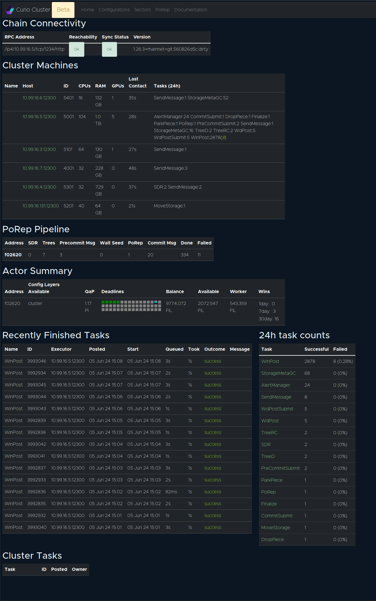
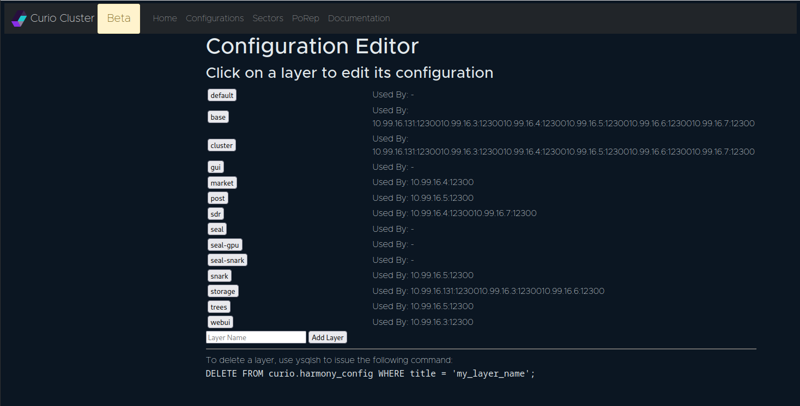
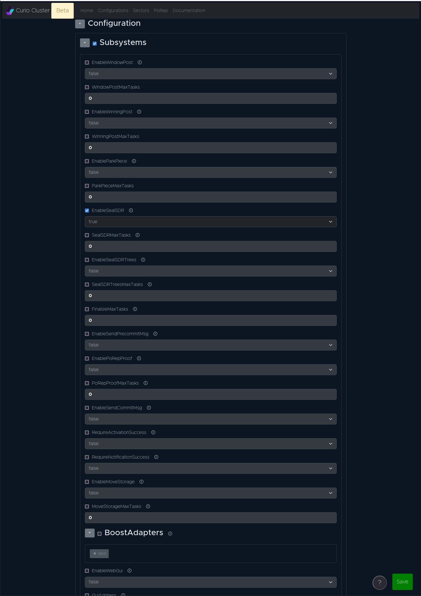
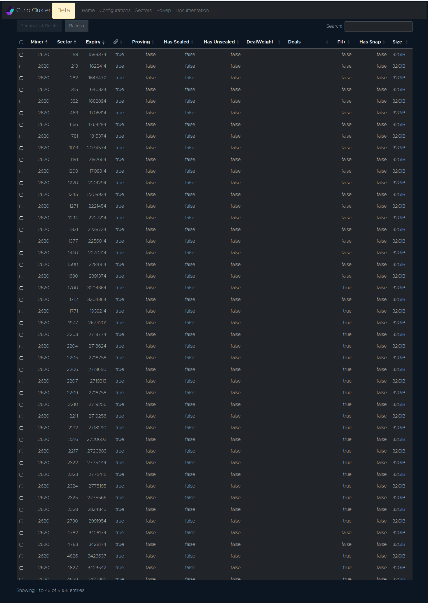
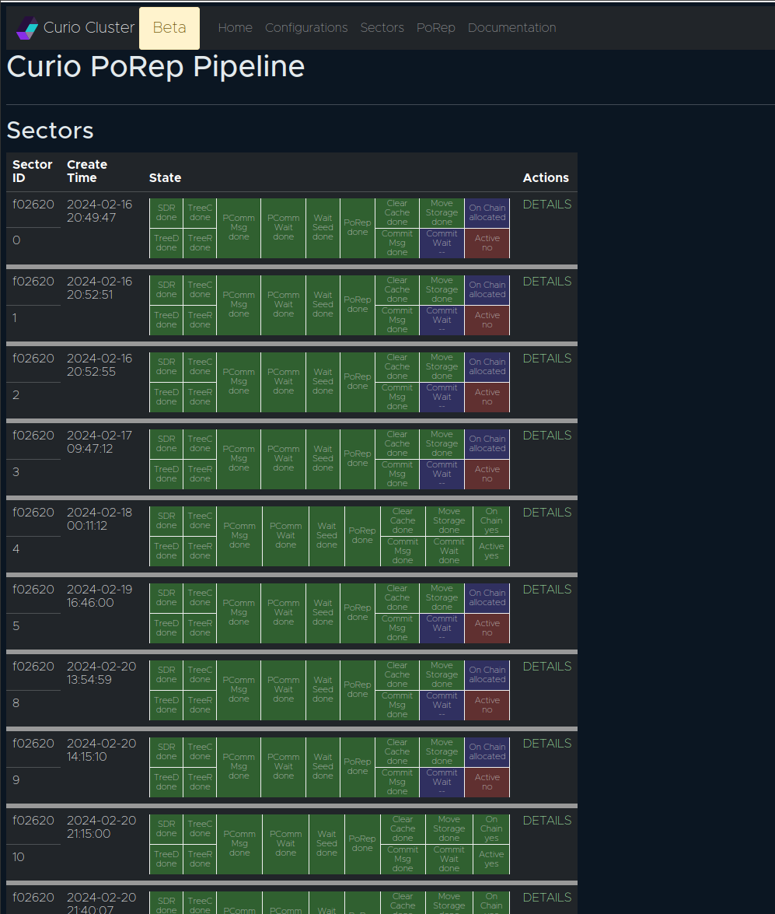
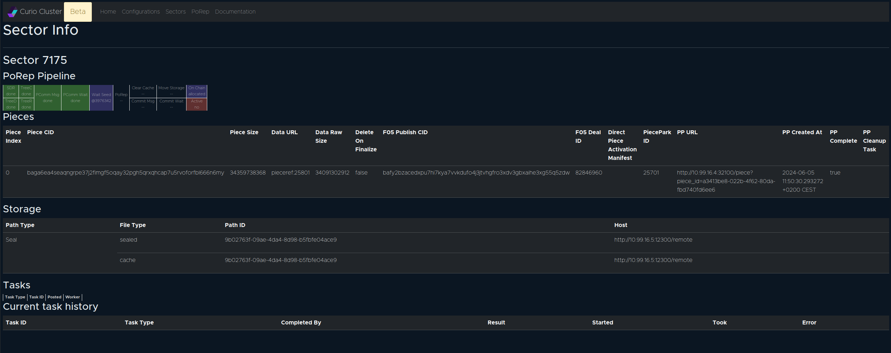
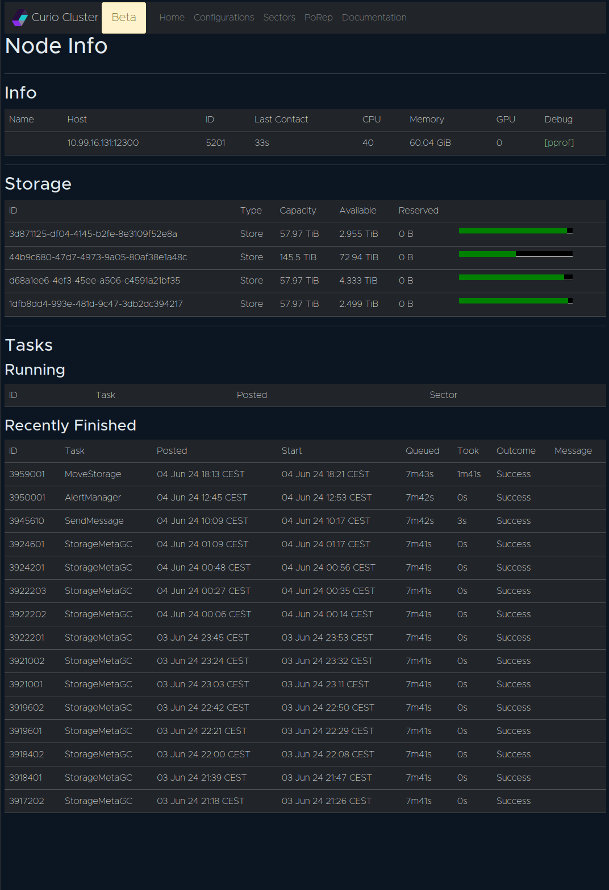

# Curio GUI

## Accessing Curio GUI

The default port is `4701` to access the Curio GUI. To enable GUI on a Curio node user must start a Curio node with `gui` layer. This is a pre-built layer shipped with Curio binaries.

### Changing default GUI port

You can change the default GUI port by setting a different IP address and port in the "base" layer of the configuration. We highly recommend not specifying the GUI address in other layers to avoid confusion.

```
curio config edit base
```

This will open the "base" layer in your default text editor.

```
  # The address that should listen for Web GUI requests.
  #
  # type: string
  #GuiAddress = "0.0.0.0:4701"

should be changed to below

  # The address that should listen for Web GUI requests.
  #
  # type: string
  GuiAddress = "127.0.0.1:4702"
```

Save the configuration and restart the Curio service on the node running GUI layer to access the GUI on the new address and port.

## GUI menu and dashboards


Curio web UI is currently under development. Some UI pages might change over time and could be different from the screenshots and description below.


### Home Page

<figure><figcaption><p>Curio home page</p></figcaption></figure>

Chain Connectivity: Chain sync status of all available Lotus daemon nodes

Cluster Machines: A quick list of all Curio nodes in the cluster

PoRep Pipeline: A quick summary of cluster wide sealing sectors

Actor Summary: Summary of minerIDs served by this Curio cluster

### Configuration page

All configuration layers can be found and edited from the `configuration` page of the GUI. It also allows adding new configuration layers via GUI.

<figure><figcaption><p>Configuration page</p></figcaption></figure>

Editing a configuration layer

<figure><figcaption><p>Editing a config layer</p></figcaption></figure>

### Sectors

Curio GUI can be used to browse the list of all sectors from all the minerID served by the Curio cluster.

This is the GUI replacement of `lotus-miner sectors list` from `lotus-miner`.

<figure><figcaption><p>Curio sector list</p></figcaption></figure>

### PoRep Pipeline

This page can be used to glance as the sectors current being sealed and historically sealed by Curio cluster. It details sector moving through the various sealing stages and status of each stage.

<figure><figcaption><p>PoRep pipeline</p></figcaption></figure>

Users can click on "DETAILS" and get more detailed information about a sector. This page will tell you about the pieces, storage etc.

<figure><figcaption><p>Sector details</p></figcaption></figure>

### Node details

On the home page, in the "Cluster Machines" list, a user can click on the machine name to get a more detailed view of each node. It will list attached storage and status of tasks handled by that particular machine.

<figure><figcaption><p>Node details</p></figcaption></figure>

