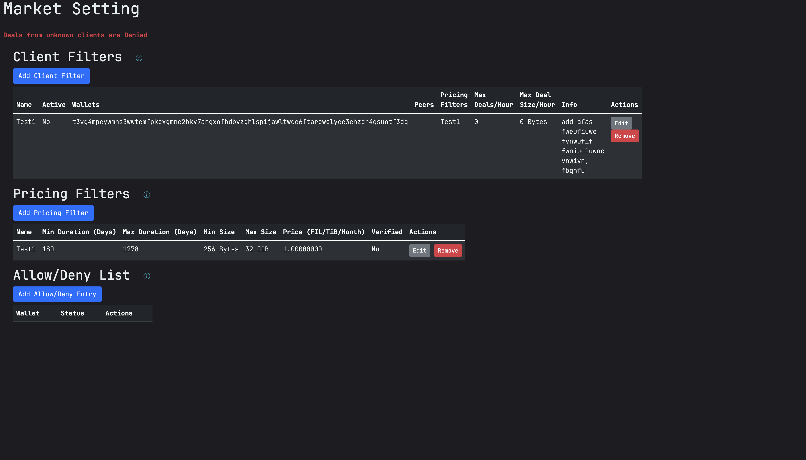
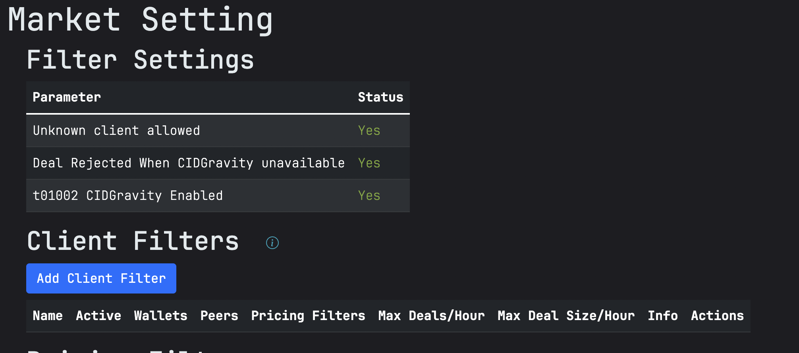

# Deal filters

## Overview

Curio provides a flexible filtering system to manage storage deals effectively. User have an option to choose from external filter like [CIDGravity](#cidgravity-filter) and built-in filters. The built-in filters allow you to:

* Set pricing rules based on deal duration, size, and whether the data is verified.
* Define client-specific rules, including rate limits and acceptable wallets or peers.
* Explicitly allow or deny deals from certain wallets, overriding the default acceptance behavior.

By configuring these filters, you can optimize your storage provisioning according to your business needs and network policies.

<figure><figcaption><p>Deal filters</p></figcaption></figure>

## Pricing Filters

Pricing Filters determine the price at which you are willing to accept storage deals based on various criteria such as duration, size, and verification status.

## Adding a Pricing Filter

1. **Navigate to the Pricing Filters section** in the Curio UI.
2. **Click on the "Add Pricing Filter"** button.
3. **Fill in the form fields**:
   * **Min Duration (Days)**: The minimum deal duration in days.
   * **Max Duration (Days)**: The maximum deal duration in days.
   * **Min Size (Bytes)**: The minimum deal size in bytes.
   * **Max Size (Bytes)**: The maximum deal size in bytes.
   * **Price (FIL/TiB/Month)**: The price per TiB per month in FIL.
   * **Verified Deal**: Check this box if the filter applies to verified deals.
4. **Submit the form** by clicking the "Add" button.

### Editing a Pricing Filter

1. **Locate the pricing filter** you wish to edit in the table.
2. **Click the "Edit" button** next to it.
3. **Modify the desired fields** in the form.
4. **Submit the changes** by clicking the "Update" button.

### Removing a Pricing Filter

1. **Find the pricing filter** you want to remove in the table.
2. **Click the "Remove" button** next to it.
3. **Confirm the deletion** when prompted.

## Client Filters

Client Filters allow you to define rules for specific clients, including rate limits and acceptable wallets or peers.

### Adding a Client Filter

1. **Go to the Client Filters section** in the Curio UI.
2. **Click on "Add Client Filter"**.
3. **Complete the form**:
   * **Name**: A unique identifier for the client filter.
   * **Active**: Check to activate the filter.
   * **Wallets**: Comma-separated list of client wallet addresses.
   * **Peers**: Comma-separated list of peer IDs.
   * **Pricing Filters**: Comma-separated list of pricing filter numbers to apply.
   * **Max Deals per Hour**: Maximum number of deals allowed per hour.
   * **Max Deal Size per Hour (GiB)**: Maximum total deal size per hour in GiB.
   * **Additional Info**: Any extra information or notes.
4. **Click "Add"** to save the filter.

### Editing a Client Filter

1. **Identify the client filter** you want to edit in the list.
2. **Click the "Edit" button** next to it.
3. **Update the fields** as needed.
4. **Click "Update"** to apply the changes.

### Removing a Client Filter

1. **Find the client filter** in the list.
2. **Click the "Remove" button**.
3. **Confirm the deletion** when asked.

## Allow/Deny List

The Allow/Deny List lets you explicitly permit or reject deals from specific wallets, overriding the default client acceptance behavior.

**Note:** Specify wallets to explicitly allow or deny deals from, overriding the default client acceptance behavior.

### Adding an Allow/Deny Entry

1. **Navigate to the Allow/Deny List section**.
2. **Click "Add Allow/Deny Entry"**.
3. **Fill in the details**:
   * **Wallet**: The wallet address to allow or deny.
   * **Allow**: Check to allow, uncheck to deny.
4. **Click "Add"** to save the entry.

### Editing an Allow/Deny Entry

1. **Locate the entry** in the list.
2. **Click the "Edit" button**.
3. **Modify the fields** as necessary.
4. **Click "Update"** to save changes.

### Removing an Allow/Deny Entry

1. **Find the entry** you wish to remove.
2. **Click the "Remove" button**.
3. **Confirm the action** when prompted.

## Default Allow Behaviour

The default allow behaviour determines whether deals from unknown clients are accepted or denied by default. This can be modified in Curio configuration.

```
// DenyUnknownClients determines the default behaviour for the deal of clients which are not in allow/deny list
// If True then all deals coming from unknown clients will be rejected.
DenyUnknownClients bool
```

* **False**: Deals from unknown clients are accepted unless explicitly denied in the Allow/Deny List.
* **True**: Deals from unknown clients are rejected unless explicitly allowed in the Allow/Deny List.

**To view the current default behaviour**:

* The Curio UI displays the default behaviour in the relevant section, indicating whether deals from unknown clients are allowed or denied.

## Usage Examples

#### Example 1: Accepting Large Verified Deals Only

* **Pricing Filter**:
  * Min Size: 1 TiB
  * Max Size: 10 TiB
  * Verified Deal: Yes
  * Price: 0 FIL/TiB/Month (or your desired price)
* **Client Filter**:
  * Active: Yes
  * Max Deals per Hour: 5
  * Max Deal Size per Hour: 50 GiB

#### Example 2: Denying Deals from a Specific Wallet

* **Allow/Deny Entry**:
  * Wallet: `t01234...`
  * Allow: Unchecked (deny)

#### Example 3: Rate Limiting a Client

* **Client Filter**:
  * Name: `HighVolumeClient`
  * Active: Yes
  * Wallets: `t05678...`
  * Max Deals per Hour: 10
  * Max Deal Size per Hour: 100 GiB

### Best Practices

* **Use Specific Filters**: Create filters that closely match your desired deal parameters to avoid unwanted deals.
* **Regularly Review Filters**: Update your filters as your storage provisioning strategy evolves.
* **Test New Filters**: Before deploying filters widely, test them with a small subset to ensure they behave as expected.
* **Monitor Deal Flow**: Keep an eye on incoming deals to adjust filters proactively.

### Troubleshooting

* **No Deals Being Accepted**:
  * Check if the default allow behaviour is set to deny.
  * Ensure your filters are not overly restrictive.
* **Error Messages When Saving Filters**:
  * Review the error displayed in the UI.
  * Ensure all required fields are filled and values are within acceptable ranges.
  * Check for duplicates in names or wallet addresses.
* **Unexpected Deals Being Accepted or Rejected**:
  * Verify the order and specificity of your filters.
  * Check the Allow/Deny List for conflicting entries.
  * Review client filters to ensure they are active and correctly configured.

# CIDGravity Filter

## What is CIDGravity?

[CIDGravity](https://www.cidgravity.com/) is a powerful pricing and client management tool designed for Filecoin storage providers. It enables storage providers to efficiently filter storage and retrieval deals through a user-friendly interface. With CIDGravity, providers can set rules and policies for accepting or rejecting deals based on their business preferences, ensuring better control over their storage operations.

For more details, refer to the [CIDGravity documentation](https://docs.cidgravity.com/).

## How to Enable CIDGravity in Curio

CIDGravity integration in Curio is controlled through Curio configuration. To enable CIDGravity, you need to set the below parameters in the configuration.
We highly recommend setting these values in "base" layer or a layer used by all market nodes to control the market behaviour.

```toml
        # CIDGravityToken is the authorization token to use for CIDGravity filters.
        # If empty then CIDGravity filters are not called.
        #
        # type: string
        #CIDGravityToken = ""
        
        # DefaultCIDGravityAccept when set to true till accept deals when CIDGravity service is not available.
        # Default behaviors is to reject the deals
        #
        # type: bool
        #DefaultCIDGravityAccept = false
```

### Configuration Options:

#### 1. `CIDGravityToken`
- **Description**: This is the authorization token required to use CIDGravity filters.
- **Default Behavior**: If left empty, CIDGravity filters will not be applied.
- **Type**: `string`

**Example Configuration:**
```toml
CIDGravityToken = "your-auth-token-here"
```


To generate a CIDGravity token [claim your miner](https://docs.cidgravity.com/storage-providers/get-started/claim-a-miner/) in CIDGravity. If you already have an existing miner then you can use the same token.


#### 2. `DefaultCIDGravityAccept`
- **Description**: Defines the default behavior when the CIDGravity service is unavailable.
- **Default Behavior**: If set to `false`, deals will be rejected when CIDGravity is not reachable. If set to `true`, deals will be accepted even if CIDGravity is not available.
- **Type**: `bool`

**Example Configuration:**
```toml
DefaultCIDGravityAccept = false
```

### Steps to Enable CIDGravity in Curio:
1. Obtain a **CIDGravityToken** from the [CIDGravity platform](https://app.cidgravity.com/).
2. Add the token to the Curio configuration file under `CIDGravityToken`.
3. Set `DefaultCIDGravityAccept` based on your preference:
    - `true` to accept deals when CIDGravity is unreachable.
    - `false` to reject deals when CIDGravity is unreachable.
   <figure><figcaption><p>CID Gravity Disabled</p></figcaption></figure>
4. Restart Curio for the changes to take effect.
5. Verify that CIDGravity is enabled via UI Market Settings page.

<figure><figcaption><p>CID Gravity Enabled</p></figcaption></figure>

Once enabled, Curio will automatically interact with CIDGravity to apply deal filtering and pricing rules according to the policies set in your CIDGravity account.


