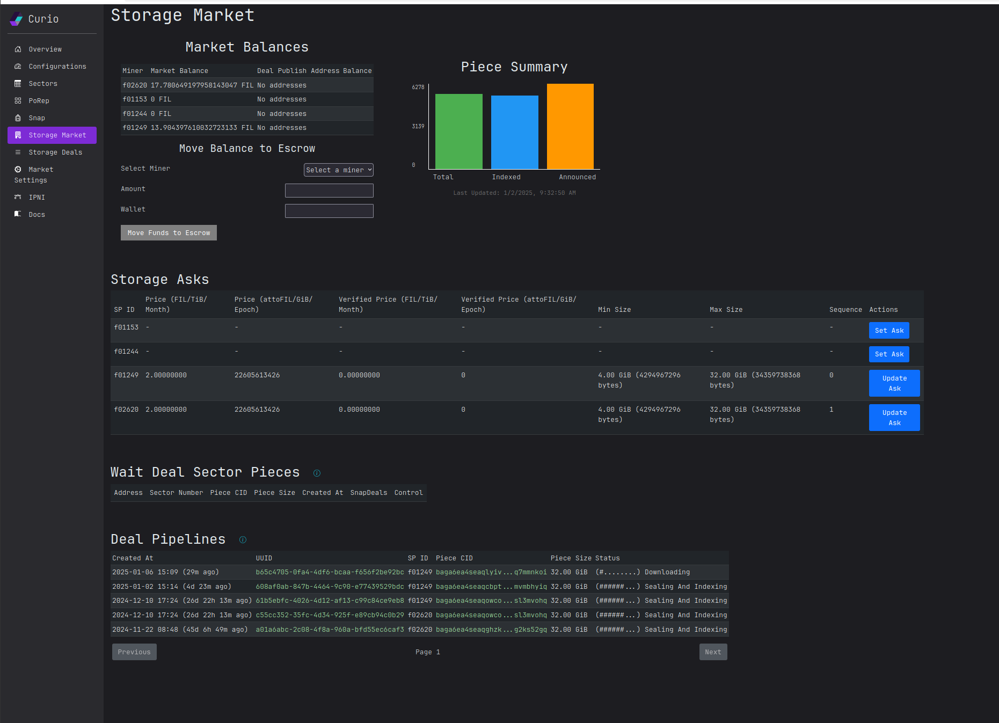

# Market UI

The "storage market" page is the main page for storage deal market. The page provides quick summary of market balances, piece status, storage ask and deal pipeline status.

<figure><figcaption>
Storage market UI page
</figcaption></figure>

You can set the storage ask for each miner ID in the Curio cluster individually from the UI.

<figure><figcaption>
Storage ask UI
</figcaption></figure>

By clocking on the UUID column of the deal pipeline in the storage market page, you can find more detailed information about the deal.

<figure><figcaption>
Deal detail page
</figcaption></figure>

The "Storage Deals" page list outs all the details in the Curio market. This can be used to get the summary of latest deals or to lookup a specific deal with unique identifier (UUID) using the search function.

<figure><figcaption>
Storage Deals page
</figcaption></figure>

The "Piece Info" contains all the deals about a piece onboarded by the Curio market. This is a one stop shop for all details about a piece and the deal containing the piece. It provides information about the piece itself, indexing, IPNI announcement status of the piece along with all the deals which contains this piece with their processing status. It also lists out the sectors which contain this piece. This is the single most important page for debugging issues with data onboarding. This page can be opened by clikcing on the "Piece Cid" from multiple pages inclusing the deal detail and deal list pages.

<figure><figcaption>
Piece Info page
</figcaption></figure>

<figure><figcaption>
Piece Info deal details
</figcaption></figure>

<figure><figcaption>
Piece Info storage pipeline status
</figcaption></figure>

All the IPNI provider and advertisement related details can be found on the "IPNI" page. The current status of IPNI provider (Curio) can be found on this page. The status is listed for each miner ID for each IPNI (ex: cid.contact) node.

<figure><figcaption>
IPNI page
</figcaption></figure>

The page also allows searching IPNI advertisements using the Cid. Users can scan the original piece to rebuild the entry list to debug issues with advertisement sync.&#x20;

<figure><figcaption>
IPNI advertisement search page
</figcaption></figure>
