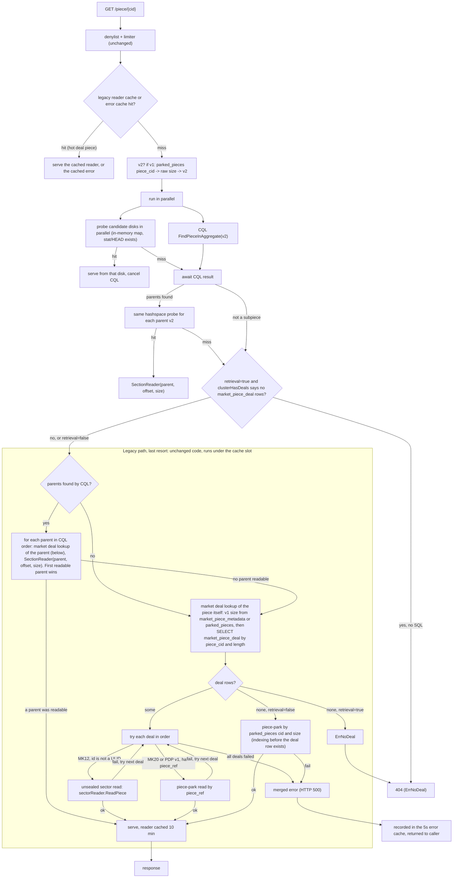

# Piece retrieval

`GET /piece/{cid}` serves a piece CID v2 straight from the open-pieces hash space, with no SQL on a hit. A v1 CID costs one `parked_pieces` lookup to become v2. A miss falls through to the legacy path: market aggregate parents, then the piece's own market deal, unsealed sector, or piece-park read.

The legacy subgraph is `getPieceReaderFromAggregate`, then `getPieceReaderFromMarketPieceDeal`, with two differences: the parents come from the stage's CQL result instead of a second `FindPieceInAggregate`, and the PDP-specific steps are gone (`getPieceReaderFromPDPPark` and the `pdp_piecerefs` existence branch in the zero-deals case).

The final error keeps `%w` wrapping of the aggregate and deal errors, so `errors.Is(err, ErrNoDeal)` still maps to 404 (for example an aggregate whose parent is not available anywhere), while sector or piece-park read failures stay 500.

PDP v1 pieces reach this path through their `market_piece_deal` rows (`piece_ref` into piece-park), which is why they keep working and why `clusterHasDeals` counts them.
