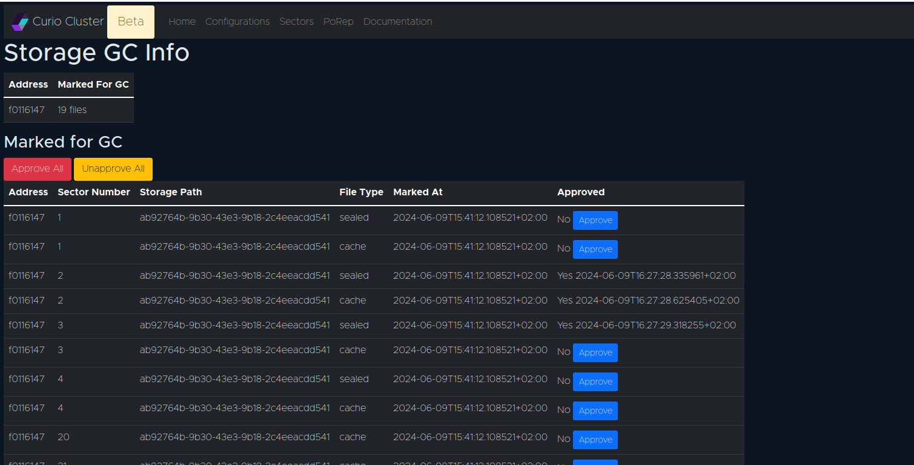
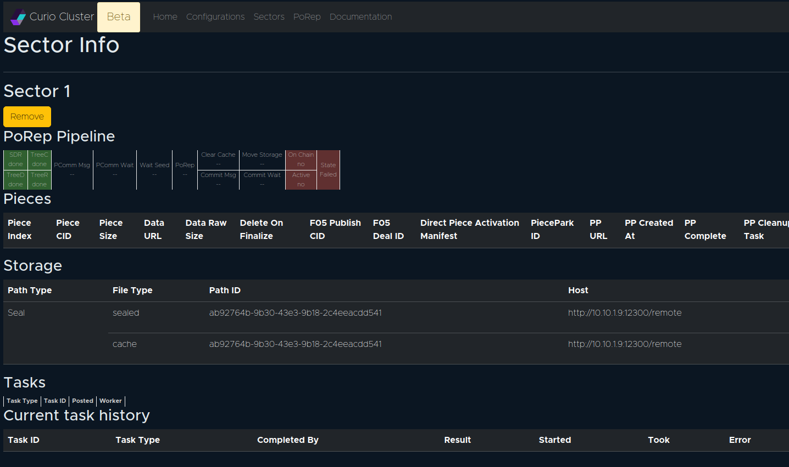

# Garbage Collection

## Sealing Pipeline cleanup

The **SDRPipelineGC** is a periodic task in the system that ensures the efficiency and effectiveness of the storage sealing process. It is responsible for cleaning up completed entries in the sealing pipeline.

### Process

The GC operates by removing sealing pipeline entries that have finished the sealing process. These entries have their metadata already stored in the long-term sector metadata table (also known as the `sectors_meta` table). This operation aids in maintaining the pipeline fluid and uncluttered, enhancing overall system performance.

### Handling failed sector

In case a sector fails the sealing process, its corresponding entry can be manually removed via the web user interface (WebUI). This function allows for active management of pipeline entries and ensures that failed entries do not stall the pipeline.

## Storage Cleanup

The `StorageGCMark` component is responsible for sweeping through all sector files in the system.

A sector file will be marked in the `storage_removal_marks` table, under the following conditions:

* The sector is not "pinned" in the `storage_gc_pins` table. (A sector pin indicates that the sector should not be removed, even after it has expired.)
* The sector is not present in the sealing table called `sectors_sdr_pipeline`.
* The sector has been labeled as a "failed" sector. (Note that "failed" sectors must first be removed from the pipeline table before they can have their data garbage collected.)
* The sector is not present in the miner actor precommit sector set.
* The sector is not present in the `Live` or `Unproven` sector sets.

### Approval and Removal

Removal marks from the `StorageGCMark` process need to be approved separately. This approval is currently available only through the WebUI. In the future, there may be extensions to allow auto-approval, backed by custom policies for selection.

<figure><figcaption>
Storage GC approval
</figcaption></figure>

Once a removal mark has been granted approval, the periodic `StorageGCSweep` task will review all approved removal marks. This task will then proceed to delete the files which have been approved for removal. This final stage ensures that only necessary data remains in the system, optimizing storage and improving the overall system's functionality.

### Removing a failed sector

For the removal of a sector that has failed the sealing process, users should go to the "PoRep" page on the WebUI and select the "DETAILS" link corresponding to the sector in question. This action will redirect them to a page where a "Remove" button is available. On clicking this button, the failed sector will be extricated from the SDR pipeline table, making it available for the StorageGCMark process to mark it for garbage collection.

However, the removal of the sector will only ensue after it gains the requisite approval. This approval can be provided on the "Storage GC Info" page. On receipt of the approval, the StorageGCSweep task will review the mark and proceed to delete the sector files, effectively removing the failed sector from the system

<figure><figcaption>
How GC a failed sector
</figcaption></figure>

