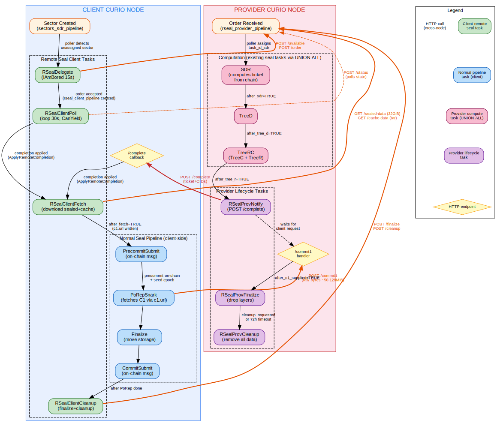

# Remote Seal (Sealing-as-a-Service)

Remote Seal allows a Curio storage provider (**client**) to delegate the
computationally expensive parts of sector sealing -- SDR, TreeD, TreeC, TreeR --
to a dedicated **provider** node. After the provider completes the heavy
computation, the client downloads the results and continues the standard
pipeline (precommit, PoRep, commit, move-storage) locally.

This splits the sealing workload so that expensive GPU/CPU hardware can be
shared across multiple storage providers without requiring each one to maintain
its own sealing infrastructure.

> **Status**: Experimental. Enable via `EnableRemoteSealProvider` /
> `EnableRemoteSealClient` configuration flags.

## Architecture

Both the client and provider Curio nodes share the same **HarmonyDB**
(YugabyteDB) cluster. Communication happens over HTTPS via a set of REST-style
API endpoints under `/remoteseal/delegated/v0/`.

### Roles

| Role | What it does | Heavy resources needed |
|---|---|---|
| **Client** | Owns the miner actor, submits on-chain messages (precommit, commit), stores sealed sectors, computes PoRep SNARK proof | GPU for SNARK, storage for sealed sectors |
| **Provider** | Performs SDR + tree computation on behalf of the client, serves sealed data and C1 output | GPU/CPU for SDR + trees, temporary storage |

### What gets delegated

Only the SDR and tree stages are delegated. Everything else stays on the client:

| Stage | Where it runs |
|---|---|
| SDR (Stacked DRG encoding) | **Provider** |
| TreeD, TreeC, TreeR | **Provider** |
| Ticket computation | **Provider** (from its own chain node) |
| Precommit message | **Client** |
| PoRep SNARK proof | **Client** (fetches C1/vanilla proof from provider) |
| Commit message | **Client** |
| Finalize + move storage | **Client** |

## Setup Flow

1. **Provider operator** creates a partner entry in the UI, specifying the
   client's base URL and an allowance (max concurrent sectors).
2. **Provider operator** generates a **connect string** -- a base64-encoded
   JSON containing the provider's HTTPS URL and auth token.
3. The connect string is shared with the client operator out-of-band.
4. **Client operator** adds the provider in the UI using the connect string,
   selecting which `sp_id` (miner) should use this provider.

## Sealing Flow (End-to-End)

1. Client's CC scheduler creates a sector in `sectors_sdr_pipeline`.
2. **RSealDelegate** (client, IAmBored task) detects the sector, checks provider
   availability via `POST /available`, and sends `POST /order`.
3. Provider accepts the order, creating a row in `rseal_provider_pipeline`.
4. Provider's **SDR task** computes the ticket from chain randomness and runs SDR.
5. Provider's **TreeD** and **TreeRC** tasks build the Merkle trees.
6. **RSealProvNotify** sends `POST /complete` to the client with CIDs and ticket.
7. Client applies the completion -- marks `sectors_sdr_pipeline` as having SDR,
   trees, and synth done, propagates ticket and CIDs.
8. **RSealClientFetch** downloads the sealed sector (32 GiB, supports HTTP Range)
   and finalized cache (~73 MiB tar) from the provider. Writes a `c1.url` file.
9. Normal pipeline resumes: precommit message is submitted on-chain.
10. When the seed epoch arrives, **PoRepSnark** runs. It detects `c1.url`,
    fetches C1 output from the provider via `POST /commit1` (raw bytes), and
    computes the SNARK proof.
11. Commit message is submitted on-chain.
12. **RSealClientCleanup** sends `/finalize` (provider drops layers) then
    `/cleanup` (provider removes all sector data).

## Database Tables

| Table | Side | Purpose |
|---|---|---|
| `rseal_delegated_partners` | Provider | Authorized partners (clients) with tokens and allowance |
| `rseal_client_providers` | Client | Configured remote seal providers per miner |
| `rseal_client_pipeline` | Client | Tracks delegated sector state (1:1 with `sectors_sdr_pipeline`) |
| `rseal_provider_pipeline` | Provider | Tracks sectors being sealed for remote clients |

## Further Reading

- [Remote Seal Provider Guide](remote-seal-provider.md) -- setting up and
  operating a provider node
- [Remote Seal Client Guide](remote-seal-client.md) -- setting up and
  operating a client node
