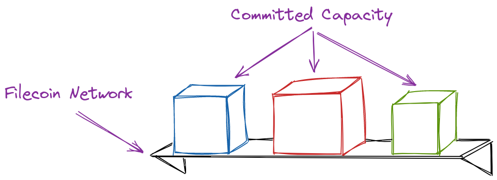
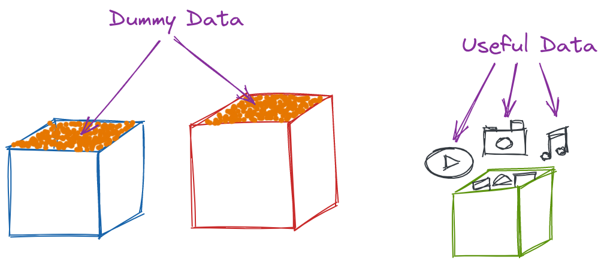
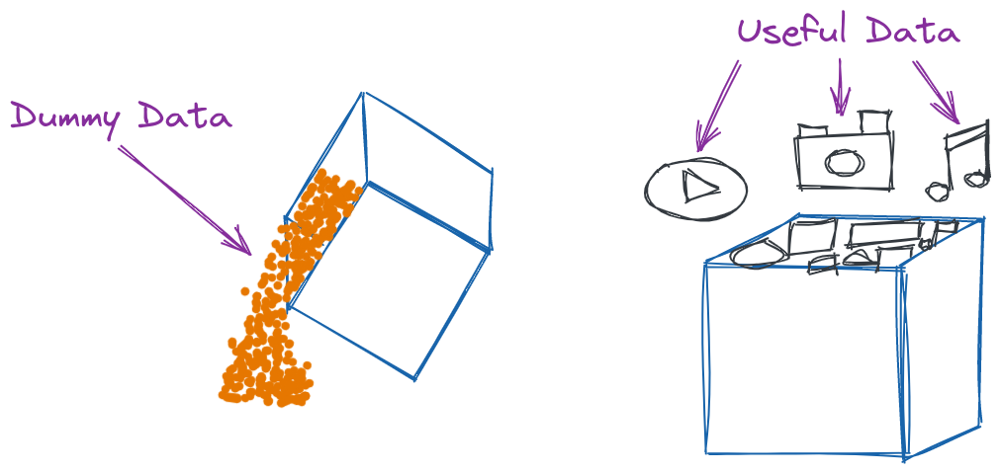

# Snap Deals

## Simplified explanation

Snap-deals allow storage providers to accept deals from users and place that user’s data into a block of storage that had already been committed. That was a bit of a mouthful, so picture it like this.

Imagine there is a town with a very long shelf. Anyone in this town can store anything they want on this shelf. When a townsperson wants to store something, they give that _thing_ to a storage provider. The storage provider builds a wooden box, puts the townsperson’s stuff into the box, and then puts the box on the shelf.

<figure><figcaption><p>Sector as a shelf</p></figcaption></figure>

Some of the boxes have useful stuff in them, like photographs, music, or videos. But sometimes, the storage providers don’t have any townspeople lining up to put useful stuff into the boxes. So instead, they put packing peanuts in the box and put that on the shelf. This means that there are a lot of boxes being made to just hold packing peanuts. Making boxes takes a long time and takes a lot of work from the storage provider.

<figure><figcaption><p>Data boxes</p></figcaption></figure>

Instead of creating a new box every time someone wants to store something, it’d be better if we could just replace the packing peanuts with useful stuff! Since nobody cares about the packing peanuts, nobody is going to be unhappy with throwing them out. And the storage provider gets to put useful stuff on the shelf without having to create a new box! Things are better for the townsperson, too, since they don’t have to wait for the storage provider to create a new box!

<figure><figcaption><p>Replacing data</p></figcaption></figure>

This is a simplified view of how Snap-deals work. Instead of a storage provider creating an entirely new sector to store a client’s data, they can put the client’s data into a committed capacity sector. The data becomes available faster, things are less expensive for the storage provider, and more of the network’s storage capacity gets utilised!

## How to enable snap-deals

To enable the snap deals pipeline in a Curio cluster, user needs to enable the snap deal specific tasks on the machines that have GPU resources. Apart from this, the deal ingestion pipeline needs to be updated to pass the deals to the snap deal pipeline instead of the PoRep sealing pipeline.


Data can be ingested using either the Snap Deals pipeline or the PoRep pipeline at any given time, but not both simultaneously.


### Enable snap tasks

1.  Add the `upgrade` layer already shipped with Curio to the `/etc/curio.env` file on the Curio nodes where GPU resources are available.\
    &#x20;

    ```
    CURIO_LAYERS=gui,seal,post,upgrade <----- Add the "upgrade" layer
    CURIO_ALL_REMAINING_FIELDS_ARE_OPTIONAL=true
    CURIO_DB_HOST=yugabyte1,yugabyte2,yugabyte3
    CURIO_DB_USER=yugabyte
    CURIO_DB_PASSWORD=yugabyte
    CURIO_DB_PORT=5433
    CURIO_DB_NAME=yugabyte
    CURIO_REPO_PATH=~/.curio
    CURIO_NODE_NAME=ChangeMe
    FIL_PROOFS_USE_MULTICORE_SDR=1
    ```

    \

2.  Restart the Curio services on the node.\
    &#x20;

    ```
    systemctl restart curio
    ```


### Update the Curio market adapter

1.  Create or update the market layer ([if one is already created](enabling-market.md#enable-market-adapter-in-curio)) for the minerID where you wish to use snap deals pipeline.\


    ```shell
    curio config add --title mt01000
    ```

    &#x20;\
    Add an entry like:\
    &#x20;

    ```
      [Subsystems]
      EnableParkPiece = true
      BoostAdapters = ["t10000:127.0.0.1:32100"]
      
      [Ingest]
      DoSnap = true
    ```

    \
    Press `ctrl + D` to save and exit.\
    Or edit the existing layer.\


    ```shell
    curio config edit mt01000
    ```

    &#x20;\
    Enable the snap deals for ingestion: \


    ```
      [Subsystems]
      EnableParkPiece = true
      BoostAdapters = ["t10000:127.0.0.1:32100"]
      
      [Ingest]
      DoSnap = true
    ```

    \
    Save the layer and exit.&#x20;

    &#x20;
2. Add the new market configuration layer to the appropriate nodes based on the [best practices](best-practices.md).
3. Restart the Curio service.
