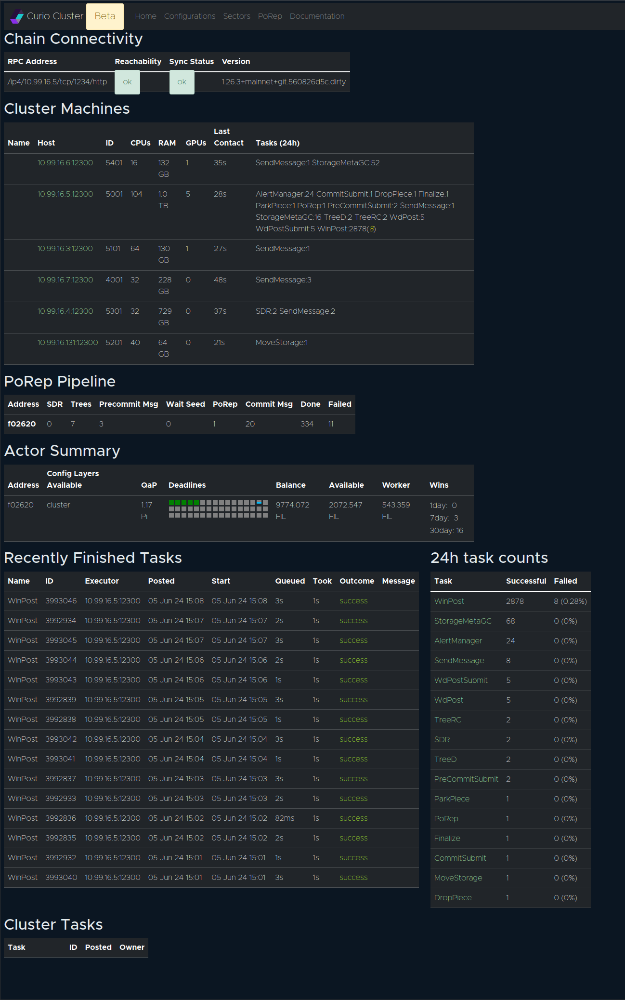
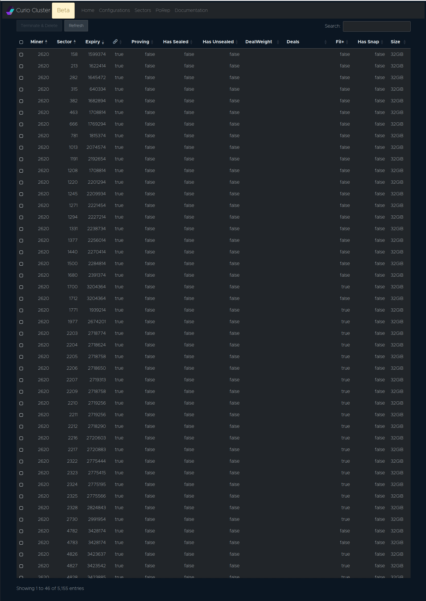
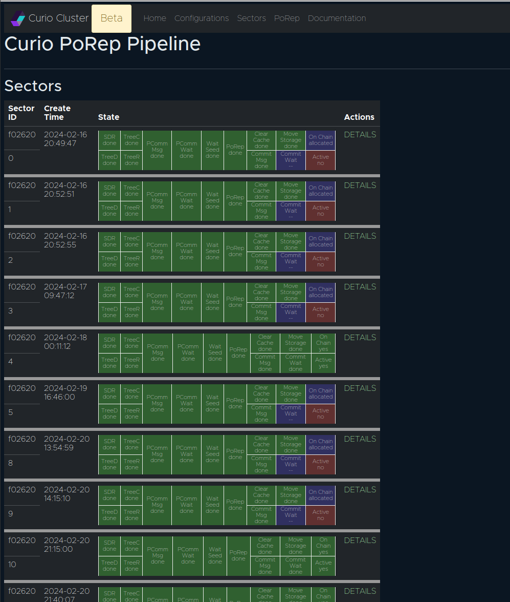

# Curio GUI

# Curio 图形用户界面

## Accessing Curio GUI

## 访问 Curio 图形用户界面

默认端口是 `4701` 以访问 Curio 图形用户界面。要在 Curio 节点上启用图形用户界面，用户必须启动带有 `gui` 层的 Curio 节点。这是一个随 Curio 二进制文件一起提供的预构建层。

建议使用网页翻译扩展程序，因为网页界面是英文的。
如果这不合理，请在 Curio 的 GitHub 仓库中提交问题。

### Changing default GUI port

### 更改默认图形用户界面端口

您可以通过在配置的“base”层中设置不同的 IP 地址和端口来更改默认的图形用户界面端口。我们强烈建议不要在其他层中指定图形用户界面地址，以避免混淆。

```bash
curio config edit base
```

这将在您的默认文本编辑器中打开“base”层。


应更改为以下内容

应该监听 Web 图形用户界面请求的地址。

```yaml
  GuiAddress = "127.0.0.1:4702"
```

保存配置并重新启动运行图形用户界面层的 Curio 服务，以访问新地址和端口上的图形用户界面。

## 图形用户界面菜单和仪表板


Curio Web 用户界面目前正在开发中。某些用户界面页面可能会随着时间的推移而更改，并且可能与下面的截图和描述不同。


### Home Page

 主页

<figure><figcaption><p>Curio 主页</p></figcaption></figure>

链连接性：所有可用的 Lotus 守护进程节点的链同步状态

集群机器：集群中所有 Curio 节点的快速列表

PoRep 管道：集群范围内封装扇区的快速摘要

参与者摘要：此 Curio 集群服务的 minerID 摘要

### Configuration page

### 配置页面

所有配置层都可以在图形用户界面的 `configuration` 页面中找到并编辑。它还允许通过图形用户界面添加新的配置层。

<figure><figcaption><p>配置页面</p></figcaption></figure>

编辑配置层

<figure><figcaption><p>编辑配置层</p></figcaption></figure>

### Sectors

### 扇区

Curio 图形用户界面可用于浏览 Curio 集群服务的所有 minerID 的所有扇区列表。

这是 `lotus-miner` 中 `lotus-miner sectors list` 的图形用户界面替代品。

<figure><figcaption><p>Curio 扇区列表</p></figcaption></figure>

### PoRep 管道

此页面可用于浏览当前由 Curio 集群封装和历史封装的扇区。它详细说明了扇区在各个封装阶段的移动情况以及每个阶段的状态。

<figure><figcaption><p>PoRep 管道</p></figcaption></figure>

用户可以点击“DETAILS”并获取有关扇区的更多详细信息。此页面将告诉您有关碎片、存储等信息。

<figure><figcaption><p>扇区详情</p></figcaption></figure>

### Node details
### 节点详情

在主页的“Cluster Machines”列表中，用户可以点击机器名称以获取每个节点的更详细视图。它将列出附加存储和该特定机器处理的任务状态。

<figure><figcaption><p>节点详情</p></figcaption></figure>
